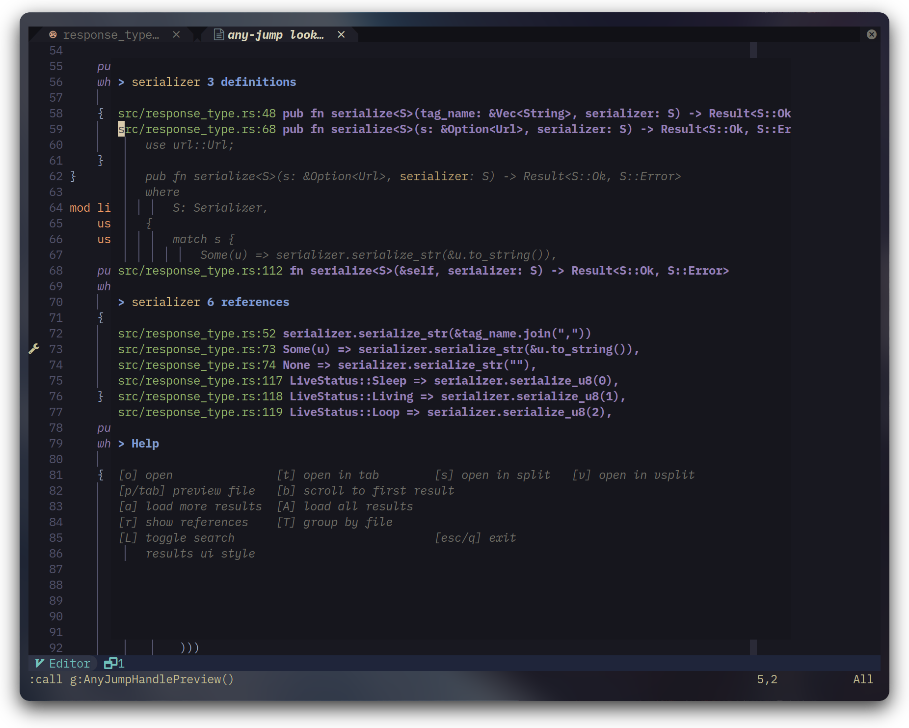

<h1 align="center">My Neovim Configuration</h1>


## Important Notes

<details>
    <summary markdown="span">Neovim v0.7.0 Incompatible Alert</summary>

Neovim v0.7.0 has released. The configuration itself is working fine.
But there are also other changes that might incompatible with your computer.

- libvterm 0.1 is now required, as neovim has bug with 0.2 version. This might
make your terminal can't handle keymap correctly.

    > Arch Linux can use this mechanic to replace the dependency:
    > https://github.com/neovim/neovim/issues/17956#issuecomment-1086647838/
    >
    > Bug Report: https://github.com/neovim/neovim/issues/16699
    >
    > Fix PR: https://github.com/neovim/neovim/pull/17329

</details>

<details>
    <summary markdown="span">Configuration Incompatible Alert</summary>
The configuration is no more compatible with neovim 0.6.0 now.
If you are still using neovim 0.6.0, please checkout to the 4.0.2 version:

```bash
git clone https://github.com/Avimitin/nvim
git checkout 4.0.2
```
</details>

- Neovim version I am using: `NVIM v0.8.0-dev+98-g069da468d5`

## Motivation

I want a text editor which is:

* Fast. I don't need to care if I will have to spend seconds or minutes on
opening a text file.
* Powerful. I can use it to learn all the programming languages. I don't
need to install IDE per language.
* Handy. I don't need to move my hand to my mouse. I don't need to click
the keyboard too much. I can have my cursor in place at the moment my eye first skim.
* Fansy. I can treat it as a work of art, not a tool.

## Getting Start

This neovim config is personally biased and was not created for generic use.
I recommend you use my configuration as a base and build your
configuration. In my opinion, everyone should have their customized
neovim.

You can press the fork button to clone my project (Don't forget
to smash the star button! `:)`) and pull the repo:

```bash
git clone https://github.com/YOUR_USERNAME/nvim.git ~/.config/nvim
```

Then rename the default branch to `upstream` and switch to a new `master` branch:

```bash
# rename master to upstream. Not necessary to be upstream, you can pick whatever you like as branch name.
git branch -m master upstream

# create new branch with name "master". Not necessary to be master too.
git branch master
```

Working with two different branches, you can always pull or pick new bugfix or feature
from my configuration without messing up your configuration.

> I will always write changes into CHANGELOG and release a new version after changes are made.
> Please read the changelog each time you pull new changes. And if you are not satisfied
> with the changes, you can `git checkout` the old version. You are also welcome to open an issue
> to discuss with me. This config is considered as **MY** personal configuration,
> and I can't guarantee I will stabilize it as the community do.

You can read the full installation instruction here:
[*Installation Guide*](https://avimitin.github.io/nvim/en_us/installation.html)

> ***Minimal vimrc***: If you want a minimal vimrc, use this
>
> ```bash
> # it is not tested yet, feel free to open issues
> curl -SL "https://raw.githubusercontent.com/Avimitin/nvim/master/.vimrc" -o ~/.vimrc
>```

## Document (WIP)

Please read [**NVIM GUIDANCE**](https://avimitin.github.io/nvim).

## Gallery

So, what will you get from my configuration?

### Speed

I have optimized almost every plugins.
Plugins can only be loaded when they are required.
They will not delay the editor to start up.
For an empty buffer, neovim takes only *25ms* to start up in average.

You can read the [benchmark file](./fixtures/benchmark.txt)
for the speed.

### Motion

With the help from lightspeed, I can hop in place with few keys.


### Markdown

Markdown can be generated in time with command `:MarkdownPreview`.


Also, there are bunch of other utilities provided by
[vim-markdown](https://github.com/plasticboy/vim-markdown).

Besides, we have the most powerful table tools in vim:
[vim-table-mode](https://github.com/dhruvasagar/vim-table-mode/)


### Colorscheme

With the help from treesitter, we can have amazing code highlight.

You can see available colorscheme here: [colors.md](./docs/src/en_us/colors.md)

### Coding

- nvim-cmp

First of all, you will have configured completion menu.


Command line can also be completed:


- lspconfig

Then, you can use `:LspInstall` to install language server.


After the installing your prefer lsp server, you will get a IDE like
coding editor:

* Document pop up


* Code actions


* diagnostic panel


* Debug Panel

1. CPP


2. Rust


* Code navigate



* Git tools

1. fugitive


2. lazygit


* file manager


## License

MIT License

## Credit

The v1.0-vimscript version is originally inspired by
[theniceboy/nvim](https://github.com/theniceboy/nvim).

And lua code since v2.0 is inspired by
[siduck76/NvChad](https://github.com/siduck76/NvChad).

Take a look at their contribution, which is really fantastic.

## Development Related

Please read [development specifications](./docs/src/en_us/development.md).
