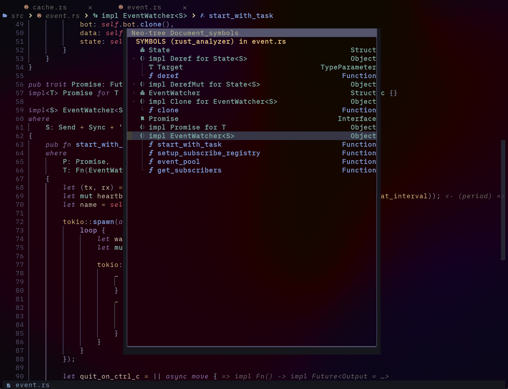
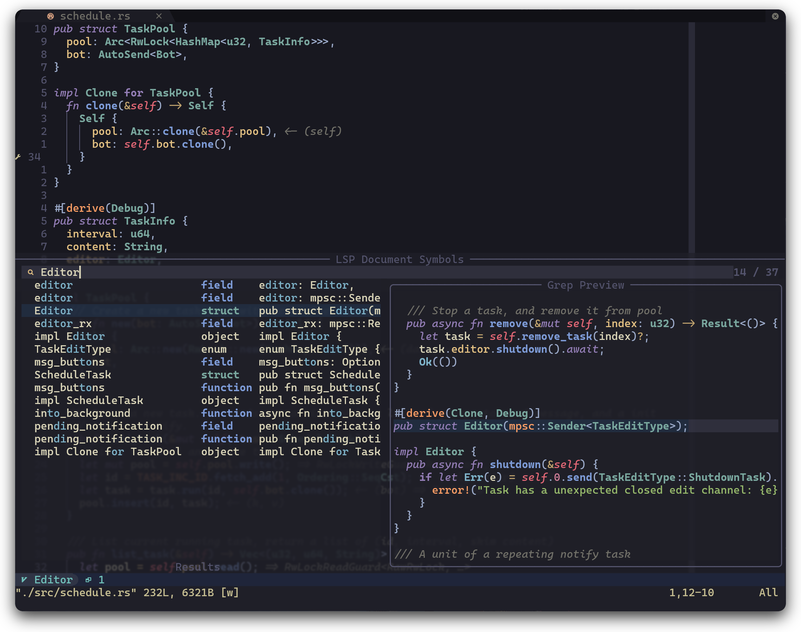

<h1 align="center">My Neovim Configuration</h1>


## Features

* ***Handy*** and ***Smoothy***: There will always be a panel to remind you
when you forget your key settings. There will always be a short keystroke to help
you get to the place you want to jump to. There will always…
* ***Powerful*** coding experience: nvim-lspconfig powered great LSP experient.
* ***Fancy looking***: Well designed, denoised, uncluttered UI. Talk is cheap, see the [gallery](#Gallery).

## Getting Start

This configuration is compatible with neovim 0.8+ version.

```bash
git clone --depth=1 https://github.com/Avimitin/nvim.git ~/.config/nvim
```

Finally, input `nvim` to open the editor, and all plugins will be downloaded automatically.

```bash
nvim
```

To use this in your home-manager, you can use the xdg.configFile attribute:

```nix
{ pkgs }:
{
    xdg.configFile = {
        neovim = {
            target = "nvim";
            source = pkgs.fetchFromGitHub {
                repo = "nvim";
                owner = "Avimitin";
                rev = "...";
                hash = "...";
            }
        };
    };
}
```

## Project Structure


- `lua`: the configuration core

    * `key-mapping.lua`: my modification to the built-in key mappings
    * `pack.lua`: script to download lazy.nvim plugin manager
    * `core/`: my modification to the built-in options and auto commands
    * `completion/`: plugins and configuration for LSP and vim command completion
    * `git/`: plugin and configuration for using git in Neovim
    * `lang/`: plugins and configuration for using LSP server and get diagnostic in Neovim
    * `libs/`: functions that I don't want to write twice
    * `note/`: markdown and neorg support for neovim
    * `tools/`: miscellaneous plugins that can enhance editing experience
    * `treesitter/`: plugins for text object highlight and editing
    * `ui/`: plugins for decorating the neovim

- `after/ftplugin/<lang>.lua`: configured LSP settings for each different language
- `ftdetect`: list of script to help neovim identify filetype for some file
- `indent`: list of script to help neovim properly set indentation
- `syntax`: additional syntax detection for some file type
- `vsnip`: my snippets


## Treesitter parsers in nix

> Ignore this if you are not a nix user

To make treesitter compatible with the stable neovim, and to make the share library compilation process reproducible and clean,
this configuration provides a treesitter parser nix expression to manage the treesitter parser plugin.
The flake output an overlay providing package `nvim-treesitter-parsers`.
To use it, you can use home-manager to help you put this package into neovim's data directory.

- Example flake based home-manager configuration:

```nix
# flake.nix

{
  description = "Flakes to reference treesiter";

  inputs = {
    nixpkgs.url = "github:NixOS/nixpkgs/nixos-unstable";
    home-manager = {
      url = "github:nix-community/home-manager";
      inputs.nixpkgs.follows = "nixpkgs";
    };
    nvim = {
      url = "github:Avimitin/nvim";
      inputs.nixpkgs.follows = "nixpkgs";
    };
  };

  outputs = { self, nixpkgs, home-manager, nvim }:
    let
      overlays = [ nvim.overlays.default ];
      pkgsIn = import nixpkgs { system = "x86_64-linux"; inherit overlays;  };
    in
    {
      homeConfigurations = {
        "laptop" = home-manager.lib.homeManagerConfiguration {
            inherit pkgs;
            modules = [ ./laptop.nix ];
        };
      };
    };
}
```

And in the example `laptop.nix`, you can create a file in `$XDG_DATA_HOME` to let neovim automatically load those parsers:

```nix
# overlay.nix
{ pkgs, ... }:
{
    xdg.dataFile.nvim-treesitter-parsers = {
        # The lua script setup rtp for neovim, so that treesitter knows where to find those parsers.
        #
        # Actually you can write the source in the below form, but using the passthru variable can keep in sync with upstream.
        # source = "${pkgs.nvim-treesitter-parsers}/treesitter-parser.lua";
        source = "${pkgs.nvim-treesitter-parsers}${pkgs.nvim-treesitter-parsers.passthru.luaScript}";
        target = "nvim/site/plugin/nvim-treesitter-parsers.lua";
    };
}
```

To add more language parser, you can use the `override` function:

```nix
nvim-treesitter-parsers.override {
    wantedParsers = [
        { name = "bash"; hash = "sha256-QQmgtC/1/8ps3tPl9X3z/sVQSlGW5h+DC364LBjLbWQ="; } 
    ];
}
```

The array expect the argument in this form: `[{ name: xxx; hash: xxx; }, ...]`,
where:

  - name string: The name of the language
  - hash string: The input hash, you can leave it blank and wait for nix hash report the correct hash
  - needs_generate bool: When true, tree-sitter CLI will be used to generate the parser.
  - srcRoot string: Specify where the parser source located. Some repository will vendor two or more parser source code in one repository.

See [my overlay](./overlay.nix) for detail examples and the current available parsers.

## Gallery

<details>
    <summary markdown="span">Utilities</summary>

| Easy in-file jump                             |
| --------------------------------------------- |
|    |

</details>


<details>
    <summary markdown="span">Markdown Utils</summary>

| Markdown Preview                                   |
|----------------------------------------------------|
|               |

| Table                                              |
|----------------------------------------------------|
|  |

</details>


<details>
    <summary markdown="span">Coding Utils</summary>

| LSP Progress |
|-----------------|
|   |

| Symbol Tree |
|-----------------|
|   |

| Code Completion                       |
|---------------------------------------|
|  |

| Command Completion                                 |
|----------------------------------------------------|
|  |

| Errorlens Like diagnostic |
|-----------------------------|
|  |

| Signature Help                       |
|--------------------------------------|
|  |

| Code Actions                                    |
|-------------------------------------------------|
|  |

| Diagnostic                                      |
|-------------------------------------------------|
|  |

| Code navigate                          |
|----------------------------------------|
|  |

| Project grep                                        |
|-----------------------------------------------------|
|  |

| Symbol search                                   |
|-------------------------------------------------|
|  |

</details>

<details>
    <summary markdown="span">File Manager</summary>

| neotree                                 |
|-------------------------------------------|
|  |

| Find file                                           |
|-----------------------------------------------------|
|  |

</details>

<details>
    <summary markdown="span">Themes</summary>

| Kanagawa Theme                          |
|-----------------------------------------|
|  |

</details>

## License

This configuration since commit `912416ae9c4b55501b23a91d774b567ba8697dd1` are
licenced under the Apache 2.0 license.

另附：禁止在 CSDN，bilibili 等国内平台使用该配置文件进行任何活动。
你只保有自己修改部分的权利。
